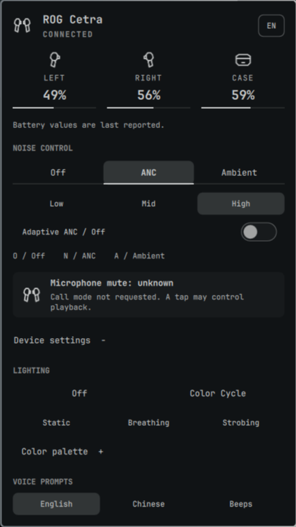

# ROG Cetra Control for Omarchy

Battery status, noise control, Aura lighting and headset voice-prompt settings
for ASUS ROG Cetra True Wireless SpeedNova over its USB receiver (`0b05:1ad3`,
interface 3). Bluetooth and other Cetra models are not supported.



Version **1.7.0 is prepared for release with documented limitations**; publication
is pending. The previous [1.6.0 pre-release](https://github.com/PavelLizunov/omarchy-rog-cetra-control/releases/tag/v1.6.0)
does not include these changes. See [RELEASE.md](RELEASE.md) for candidate status
and [BACKLOG.md](BACKLOG.md) for accepted limits and untested scenarios. The preview
predates the optional microphone meter and is not a screenshot of every 1.7.0 control.

## Install

Plugins run unsandboxed with your user permissions inside the existing Omarchy
shell. This plugin uses a native receiver helper and persistent local diagnostics.
Review [Security and privacy](#security-and-privacy) before installing.

Runtime dependencies: Omarchy Quattro/Quickshell, `hidapi` (hidraw backend),
`libpulse` and Quickshell's PipeWire service. A PulseAudio-compatible audio server
is needed for peak capture. Setup additionally uses `bash`, `jq` and GNU `timeout`.
Building needs a C compiler and `pkg-config`.
The manual setup script can install `base-devel`, `hidapi`, `libpulse` and `pkgconf`; it
does not install every runtime or test dependency.

```bash
omarchy plugin add https://github.com/PavelLizunov/omarchy-rog-cetra-control.git --yes
~/.config/omarchy/plugins/io.github.pavellizunov.rog-cetra-control/setup
omarchy plugin enable io.github.pavellizunov.rog-cetra-control --section right
```

The Marketplace clones source; it does not execute setup automatically. Setup
compiles all three helpers, runs their offline selftests and validates the folder.
It requires an explicitly unlocked Omarchy session; locked, unavailable or
malformed lock-status responses prevent binary replacement.

## Use

Click the bar icon to open the panel. Right-click or use the wheel to cycle noise
modes. The vertical bar omits battery text; the horizontal bar can show the lowest
reported earbud percentage.

- **Noise control:** Off, ANC and Ambient. In ANC, select Low/Mid/High or Adaptive.
  A manual level requests Adaptive Off when its current state is On or Unknown.
- **Battery:** percentages are last-reported values. Missing data is not proof of
  case placement. Detailed availability/charging observations are in the tooltip.
  A present earbud with missing battery reports stays visibly available with
  "Available; battery unknown". Its percentage is not copied from the other earbud
  or replaced with an old log value.
- **Voice prompts:** English, Chinese or Beeps; these are headset settings,
  separate from the interface language.
- **Keyboard:** Tab/Shift+Tab traverse controls, arrows move focus, Enter/Space
  activate, Escape closes. O/N/A select noise mode; 1/2/3 select ANC level.
  Russian-layout equivalents are supported for O/N/A. RGB arrows edit the channel;
  Enter focuses Apply.

Controls require receiver/earbud availability. Once presence has been observed,
stale battery values cannot re-enable controls. Pending settings wait up to 48
250 ms scheduler ticks (nominally 12 seconds), allowing the periodic ten-second
readback cycle. A late matching reply clears the error without repeating a write.
The selected state is readback, not an optimistic click result.

### Lighting

Open Device settings → Lighting → Color palette. Select the theme accent or
integer RGB channels (0–255), then press Apply or choose an effect.

- Changing RGB/theme selection saves preferences only.
- Apply retains Static/Breathing/Strobing; from Off/Cycle/Unknown it selects Static.
- **Update with theme changes** is separate and defaults Off. With it enabled,
  explicitly apply a colored effect once per helper/connection session. Subsequent
  accent changes are coalesced for 350 ms and sent by the shared service.
- Enabling auto-theme explicitly reapplies an existing colored effect. Off and
  Cycle are never replaced automatically; identical payloads are deduplicated.
- Helper/receiver reset disarms automatic theme updates. Saved permission alone
  sends nothing at startup; apply a colored effect again to resume.
- The native owner may replay its last successful explicit preference on reconnect
  within the same owner session. Restart forgets that preference.

The preview is your selection. “Last sent” means a complete helper transmission,
not physical color readback. A partial USB write can change a zone even if the
transaction fails. The official Off/duplicate-commit sequence still needs capture
verification; the implemented sequence is recorded in RESEARCH.md.

### Microphone and calls

**Native microphone mute is unknown to the plugin.** Follow the headset voice
prompt. The plugin does not decode it, record PCM, infer mute from tap parity or
offer synthetic software mute as a native hardware control.

### Optional microphone signal meter

Enable **Show microphone level** in Device settings to add a compact meter beside
the bar icon. It measures the physical Cetra input, not the default mic or audio
after application processing. Movement means signal is present; zero is not proof
of native mute. Missing capture data is shown separately as dim marks.

The feature defaults Off and uses `bin/cetra-peak`, built by setup with `libpulse`.
One service-owned monitor is loaded only while enabled and earbuds are available.
Peak capture starts only when an external endpoint has a verified active audio
path from Cetra. Processing clients, monitors and keepalives alone do not count.
Its own link cannot keep it alive or count as a call. Ordinary recording can show
a level without requesting call context. Mixed or incomplete routes fail closed.
The helper pins its own stream to Cetra using Pulse and WirePlumber properties;
no EasyEffects exclusion or application-route change is required on the tested
PipeWire 1.6.8/WirePlumber host. Source mismatch stops capture; unavailable sources
or helper failures show no data and retry every two seconds while input is in use.

The audio server computes peaks; the helper receives only 20 mono peaks/second.
No audio or level samples are saved or sent over the network. This creates an additional PipeWire capture stream,
removed when external use ends, the option is disabled or the service unloads.
The helper publishes at most 20 updates/second. The cube-root visual scale is not dB SPL,
speech recognition, application audibility or hardware mute readback.

PipeWire topology events drive automatic call-context requests. Lost or unknown
capture is confirmed by a bounded two-second settlement timer. Explicit phone /
communication roles take precedence; untagged known communication applications
use a name fallback. An untagged generic browser capture does not prove a call.
The JSON `call_context` value is a requested context, not confirmed tap assignment.

**Continuous background microphone capture can prevent native Play/Pause taps.**
A controlled trial on this host reproduced the failure with a Voxtype keepalive
capturing through EasyEffects, recovery when capture stopped, and recurrence
when it resumed. The Cetra meter was absent and `call_context` was false. Vendor
tap reports alone do not prove that a media key was delivered. The plugin does
not change other applications or synthesize Play/Pause from those reports.
See the dated evidence in [RESEARCH.md](RESEARCH.md).

The manual Request call mode control and M/Ь shortcut were removed because their
benefit outside a real call was unverified. Legacy `alwaysCallContext` is ignored.
The proximity/auto-pause control and P/З were also removed: enabling its sensor
setting did not establish PC playback pause over USB. Neither removal changes the
headset's existing proximity setting. Research commands remain in daemon IPC.

User trials found effective mute could be lost across left-earbud availability
changes without another tap. Read the dated [protocol research](RESEARCH.md)
before relying on behavior across case transitions. These are observations, not
a firmware guarantee or absolute mute readback.

## Interface language and preferences

Use the language button in the header: System, English, Russian, German, French,
Spanish, Italian, Portuguese, Simplified Chinese, Japanese or Korean. System is
the default. Manifest settings labels remain English. All catalog keys and
placeholders are checked; fluent-human review of every locale remains pending.

Fallback is exact locale → compatible base → English → source text. Traditional
Chinese requests use `zh-Hant`/English rather than the Simplified `zh` catalog.
An explicit script takes precedence over region. See [locales/README.md](locales/README.md).

UI preferences live in the plugin's inline entry in `~/.config/omarchy/shell.json`.
Writes use the scoped Omarchy API. `CetraPreferences.qml` reads the saved entry
through the bounded `cetra-status --read-settings` helper because host snapshots
and widget injections can be stale. FileView only watches changes (`preload: false`)
and does not read the document. Reads are coalesced for 100 ms, limited to one
process, capped at 1 MiB before output, and bounded to three seconds. Missing,
non-regular, oversized or detected concurrently modified files are rejected.
Accepted writes override older completions until readback or a three-second
reload; malformed reads preserve last valid state.

**Disabling/re-enabling can reset inline preferences in the tested Omarchy host.**
Back up your plugin entry before doing so. Ordinary popup close/reopen does not
disable the plugin. The plugin does not maintain a second hidden settings file.

## Update and remove

```bash
omarchy plugin update io.github.pavellizunov.rog-cetra-control
~/.config/omarchy/plugins/io.github.pavellizunov.rog-cetra-control/setup
```

After updates, verify an actual visible change. The tested host sometimes kept
old QML despite reload logs. If needed, restart the shell when unlocked and when
interruption of shell services is acceptable. Never launch a second Quickshell
instance for this plugin.

```bash
omarchy plugin disable io.github.pavellizunov.rog-cetra-control
omarchy plugin remove io.github.pavellizunov.rog-cetra-control
```

There is no system service. Generated helpers are removed with the folder; logs
remain. After the owner has stopped, remove the log and `.old` backup described
below if you want to delete diagnostics.

## Security and privacy

- One long-running owner opens receiver interface 3. Other clients use the
  private UNIX socket, not a competing hidraw reader.
- Runtime has no network calls. Repository/package installation and updates use
  the network. Setup does not download or execute Windows firmware tools.
- The helper sends the documented read queries and explicit control reports.
  Call requests and valid session lighting replay can occur automatically; see
  [HANDBOOK.md](HANDBOOK.md) for cadence and [RESEARCH.md](RESEARCH.md) for opcodes.
- Settings and presence/charging expire after 30 seconds. Battery/mode freshness
  flags also expire after 30 seconds; the UI hides stale values. Raw daemon battery
  and mode fields remain last-reported values for diagnostic compatibility.
- Runtime socket/lock/cache require an owner-private `$XDG_RUNTIME_DIR`. Missing,
  relative or shared roots are rejected; there is no shared `/tmp` fallback.
  Cache replacement uses a private unique temporary file and rename.
- IPC validates command domains and framing. Owner sends handle partial writes,
  disconnecting clients on backpressure. Owner stdout retains at most a partial
  frame and the latest pending state; mirror queues are bounded to 4 KiB per direction.
- Call detection reads PipeWire metadata, not audio samples. The optional meter
  creates a peak-capture stream as described above. Device serial numbers are not
  persisted. No system microphone mute or existing audio routing is changed.
- Owner-only telemetry logs commands/RGB, gestures, battery/settings, lifecycle,
  timestamps and raw unhandled HID bytes. This can reveal usage timing.
- Log path: `${XDG_STATE_HOME:-$HOME/.local/state}/omarchy/rog-cetra-control.log`.
  If unsafe/unavailable, a verified private runtime directory is tried. Files are
  no-follow, owner/type/single-link checked and mode 0600. Ancestors are checked
  for links, ownership and writable paths; this is not a descriptor-relative
  guarantee against concurrent same-user directory replacement.
- Above 5 MiB the log rotates to one `.old` backup. Set `CETRA_DIAGNOSTICS=0` in
  the environment inherited by the shell before starting it to disable new
  diagnostic writes (existing files remain). Logging/cache I/O is synchronous;
  a stalled filesystem can still delay the owner. Shared-shell teardown remains best effort for hung
  descendants; one passing normal exit does not cover every reload race.

## Development and verification

[MODULES.md](MODULES.md) maps changes to source owners and tests.
[HANDBOOK.md](HANDBOOK.md) describes architecture; [CONTRIBUTING.md](CONTRIBUTING.md)
contains contribution rules. Historical records are not current runtime specs.

```bash
./tests/run.sh
omarchy plugin validate .
git diff --check
```

Tests additionally require Python 3, Node.js, a C++ compiler, Qt6Quick/Qt6Qml/Qt6Gui
development libraries and the installed Omarchy shell sources. Some suites still
require `/tmp/opencode` to exist; this is temporary-path debt, not an OpenCode
installation requirement. Tests compile in isolation and never open real HID.
Offline suites and actual Qt checks do not replace live hardware/UI acceptance.

For offline JSON output from the already-built fixture helper:

```bash
CETRA_STATUS_FIXTURE='{"status":"ok","receiver":false,"microphone_state":"unknown"}' ./bin/cetra-status
```

This prints JSON; it does not preview the UI or inject fixtures into a running shell.

## Compatibility and license

Only the SpeedNova USB receiver listed above has been tested. Versions through
1.2.1 used `io.github.pavellizunov.rog-cetra-battery`; remove that old plugin before
installing the renamed one. ROG, Cetra, SpeedNova and ASUS are ASUSTeK trademarks.
This community project is not affiliated with ASUS. Source is MIT; see [LICENSE](LICENSE).
